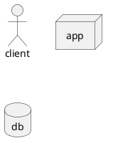

# tbm
description
## s-title


db -> app
app -> client
@enduml

```plantuml
@startuml test7
left to right direction
skinparam sequenceArrowThickness 2
skinparam interface {
  backgroundColor RosyBrownborderColor orange
}
rectangle "external" #eeeeee{
  actor "user dev" as user
  user --> [internet explorer]
}
rectangle "home"  #eeeeee{
  package "box" #ffffff{
    rectangle nat
  }
  package "rock64" #ffffff {
    rectangle "proxy / ssl / auth" as proxy
  }
  package "pine01" #ffffff  {
    rectangle "stack docker theia"{
      frame "theia_server_dan" as dan{
        rectangle theila
        rectangle "front server" as front #aaeeff
        rectangle "back server" as back #aaeeff
      }
      frame "inspire-mongodb"{
        database inspire as db
      }
      frame "inspire-mongo-express"{
        rectangle "mongo-express" as express
      }
    }
    front -[#558855]-> back ::8080
    front -[#558855]-> express ::80/mongodb
    nat --> proxy ::443
    proxy -[#5555CC]-> theila :8082:8081
    proxy -[#558855]-> front :8080:3000
    back -[#558855]-> db ::27017
    express -[#558855]-> db ::27017
  }
  [internet explorer] -[#5555CC]-> nat :code:443
  [internet explorer] -[#558855]-> nat :webdev:443
  @enduml
  ```
